# 3D Military Base Camp

An interactive 3D military base camp visualization developed using OpenGL. The project presents a detailed military environment with buildings, vehicles, defensive structures, lighting effects, animations, texture mapping, and keyboard-controlled interactions.

The scene can be explored from different camera angles, including a bird's-eye view. Users can move around the base, control selected vehicles, open and close doors, rotate the radar system, change rendering modes, and switch between day and night lighting conditions.

## Project Overview

The military base is designed as a structured and secure environment enclosed by boundary walls and a main entrance gate. A central road runs through the base and connects its main components.

The scene includes accommodation areas, garages, a medical center, surveillance structures, military vehicles, environmental objects, and animated elements. Most objects are created using basic geometric shapes, while selected detailed assets such as the tank and tent use external 3D models.

## Main Features

* Fully explorable 3D military base environment
* Keyboard and mouse-based camera navigation
* Bird's-eye view for observing the full layout
* Interactive military jeep and truck controls
* Tank movement animation
* Rotating radar system
* Animated campfire with local lighting
* Opening and closing doors, windows, and entrance gate
* Day and night lighting modes
* Toggle controls for ambient, diffuse, and specular lighting
* Jeep headlights with spotlight effect
* Texture mapping for buildings, vehicles, ground, road, and environmental objects
* Multiple rendering modes for selected objects
* Interior details inside the barracks and medical center

## Scene Components

### Military Vehicles

The project contains a detailed military jeep, a six-wheel military truck, and a model-based tank.

The jeep includes a lower body, upper cabin, doors, windshield, roof, hood, wheels, headlights, grille, bumpers, mirrors, spare tire, and exhaust. It supports door and window interactions, headlights, movement controls, and a vehicle camera view.

The truck includes a long chassis, driver cabin, six wheels, cargo bed, cover, side panels, flaps, grille, mirrors, lights, and bumper. It can be selected and moved using keyboard controls.

The tank is an imported GLTF model that can be animated within the scene.

### Barracks

The barracks are wooden buildings with pitched roofs, doors, windows, and indoor furniture. The interior includes beds and basic structural details. A campfire is placed near the barracks to improve the atmosphere of the base camp.

### Military Medical Center

The medical center is a separate building with concrete-style walls, a roof, a main door, and two windows. The interior includes beds, tables, and a first-aid box.

### Garages

The garage area contains raised platforms, surrounding walls, roofs, ramps, and open entrances for military vehicles. The garages are positioned to allow vehicles to enter and exit the structures.

### Watch Towers

The base contains elevated watch towers supported by pillars. Each tower includes a platform, roof, railings, stairs, and an antenna for surveillance.

### Radar Station

The radar station includes a base platform, support structure, surrounding walls, and a rotating radar dish. Its rotation can be enabled or disabled using the keyboard.

### Boundary and Main Gate

The entire military base is enclosed by perimeter walls. A main gate supported by pillars forms the entrance to the camp. The gate can be opened and closed interactively.

### Military Road and Ground

A road runs through the central area of the base and provides a movement path for military vehicles. The road includes surface markings, while the surrounding ground uses repeated textures to create a tiled terrain appearance.

### Environmental Elements

The environment also includes a campfire, trees, sunlight, indoor lights, garage lights, barrack tube lights, and radar lighting effects. A model-based military tent is also placed within the camp.

## Fire Animation and Vehicle Obstacles

### Campfire Animation

The campfire is created with wooden logs, a circular pebble boundary, animated flame layers, rising sparks, and a flickering orange point light. Six lower logs are arranged in a radial pattern using a loop, while three additional logs are stacked above them. Fourteen pebbles are also generated in a loop with different positions, sizes, rotations, and stone-like colour variations.

The flame is formed using six layered cubes, ranging from a wide orange base to a narrow yellow-white tip. Each layer continuously sways sideways, moves slightly upward and downward, and changes size using sine-based animation. A separate loop generates five small ember sparks that repeatedly rise from the fire and gradually fade. Blending is enabled while drawing the flames to create a softer fire effect. The nearby point light also changes intensity over time, producing a realistic flickering glow.

### Vehicle Obstacle Detection

Vehicle obstacles are handled using 2D axis-aligned bounding boxes. Rectangular collision areas are defined for the jeeps, truck, garages, barracks, medical building, boundary walls, watch towers, tank, radar station, campfire, trees, and tent.

Before moving a vehicle, the program calculates its next position and checks whether its bounding box intersects with any obstacle box. The vehicle moves only when no intersection is detected. The road remains open for driving, and the garage platforms include ramp-height calculations so vehicles can move smoothly between the ground and raised platforms. Jeep-to-jeep collision is enabled, while collision between the truck and jeeps is currently disabled.

## Controls

### Camera Movement

| Key            | Action                 |
| -------------- | ---------------------- |
| `W`            | Move forward           |
| `S`            | Move backward          |
| `A`            | Move left              |
| `D`            | Move right             |
| `X`            | Pitch camera upward    |
| `C`            | Pitch camera downward  |
| `Q`            | Rotate camera left     |
| `E`            | Rotate camera right    |
| Mouse movement | Look around            |
| Mouse scroll   | Zoom in or out         |
| `O`            | Toggle bird's-eye view |

### Vehicle Selection and Movement

| Key         | Action                             |
| ----------- | ---------------------------------- |
| `J`         | Select or cycle through jeeps      |
| `P`         | Select or deselect the truck       |
| Up Arrow    | Move the selected vehicle forward  |
| Down Arrow  | Move the selected vehicle backward |
| Left Arrow  | Turn the selected vehicle left     |
| Right Arrow | Turn the selected vehicle right    |

### Jeep Controls

| Key | Action                               |
| --- | ------------------------------------ |
| `V` | Change vehicle camera view           |
| `D` | Open or close the jeep door          |
| `W` | Open or close the jeep window        |
| `L` | Toggle jeep headlights and spotlight |

### Truck and Ground Controls

| Key | Action                       |
| --- | ---------------------------- |
| `V` | Change truck camera view     |
| `K` | Change truck rendering mode  |
| `M` | Change ground rendering mode |

### Structure Controls

| Key | Action                          |
| --- | ------------------------------- |
| `T` | Toggle tank movement            |
| `R` | Toggle radar rotation           |
| `B` | Open or close the barrack door  |
| `U` | Open or close the main gate     |
| `G` | Open or close the building door |
| `H` | Open or close the left window   |
| `I` | Open or close the right window  |

### Lighting Controls

| Key | Action                                           |
| --- | ------------------------------------------------ |
| `4` | Toggle ambient lighting                          |
| `5` | Toggle diffuse lighting                          |
| `6` | Toggle specular lighting                         |
| `7` | Toggle sunlight and switch between day and night |

### General Control

| Key   | Action               |
| ----- | -------------------- |
| `ESC` | Exit the application |

## Lighting Effects

The scene includes several lighting sources to improve visibility and realism:

* Directional sunlight for the overall scene
* Point lights for local illumination
* Jeep headlights with a focused spotlight beam
* Garage lighting
* Barrack interior tube lights
* Campfire lighting
* Radar station lighting
* Day and night mode switching

## Textures and Rendering

Textures are applied across the scene to improve the appearance of surfaces such as:

* Wooden barrack walls and roofs
* Brick and concrete-style structures
* Garage walls and floors
* Vehicle bodies and wheels
* Ground tiles
* Military road
* Boundary walls
* Trees
* Campfire surroundings
* Radar dish

The project also supports changing selected rendering modes during runtime.
## Project Figures

### Base Camp Overview

  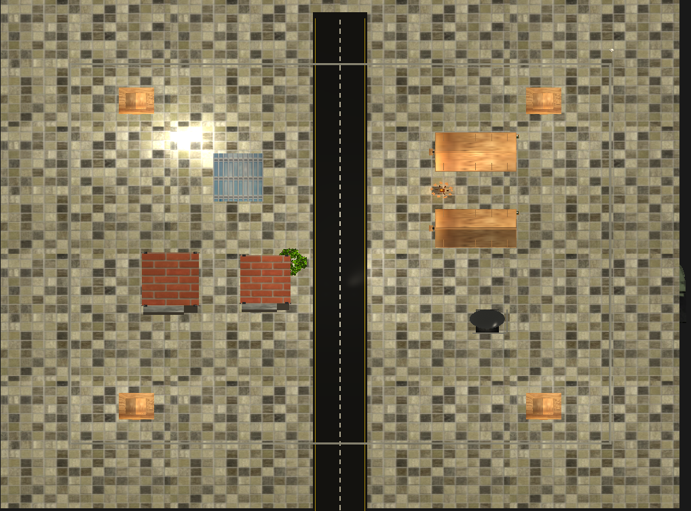
   
  <em>Figure 1: Bird's-eye view showing the overall layout of the military base camp.</em>

### Barracks and Campfire

  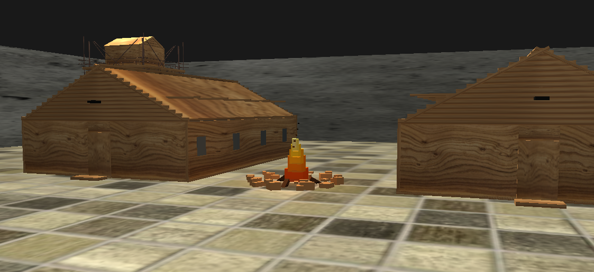
   
  <em>Figure 2: Two wooden barracks with the animated campfire placed between them.</em>

  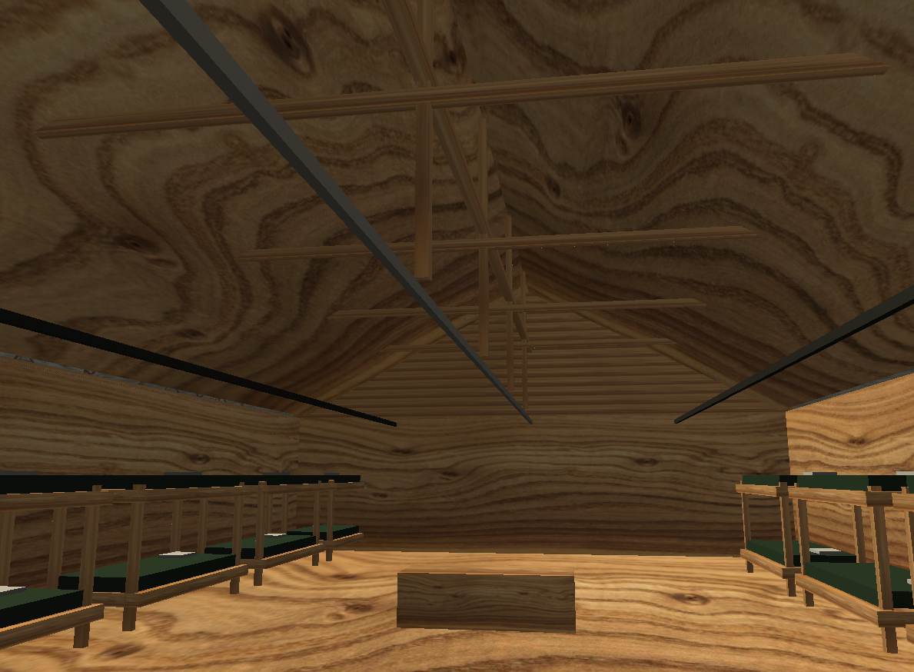
   
  <em>Figure 3: Interior view of the barrack showing double beds and basic furniture.</em>

### Garages

  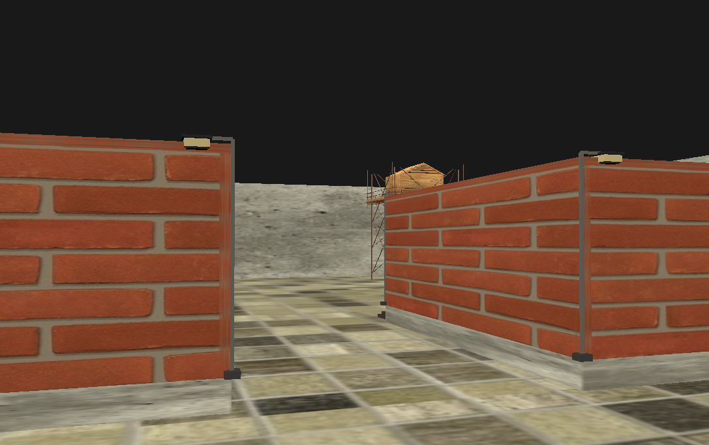
   
  <em>Figure 4: Rear view of the garages with lighting at the back.</em>

  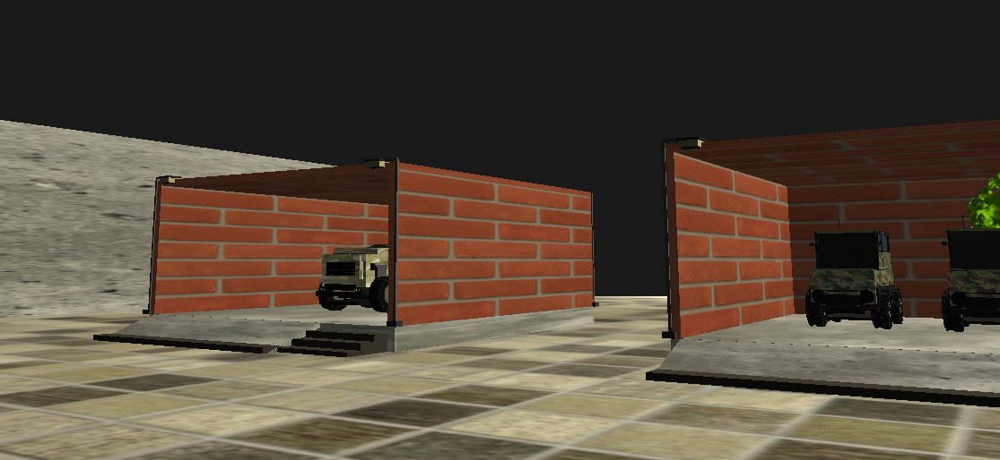
   
  <em>Figure 5: Front view of the garage platforms used for vehicle storage.</em>

  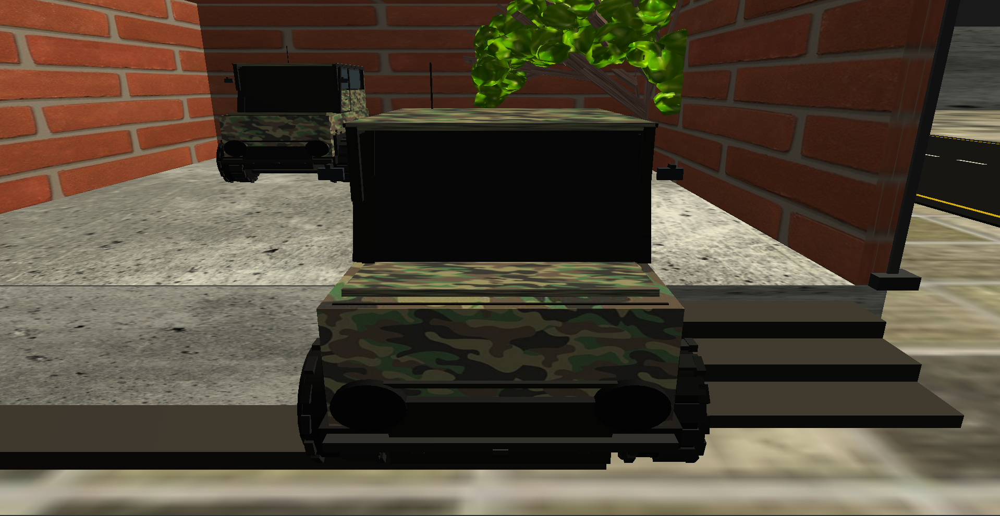
   
  <em>Figure 6: Garage slope allowing vehicles to move smoothly between the ground and raised platform.</em>

### Military Medical Center

  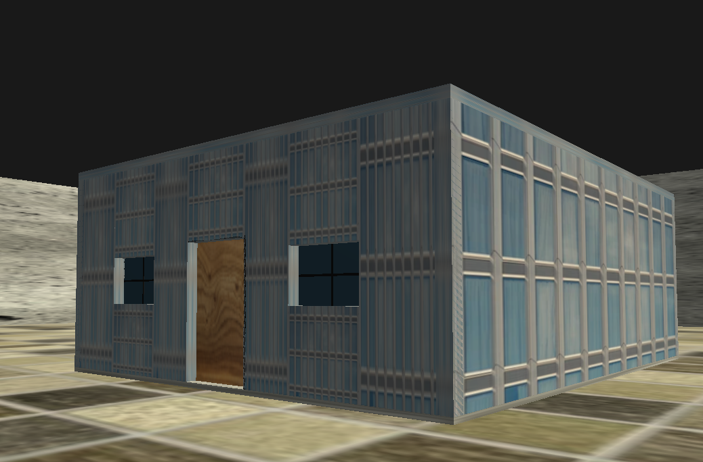
   
  <em>Figure 7: Exterior view of the military medical center.</em>

  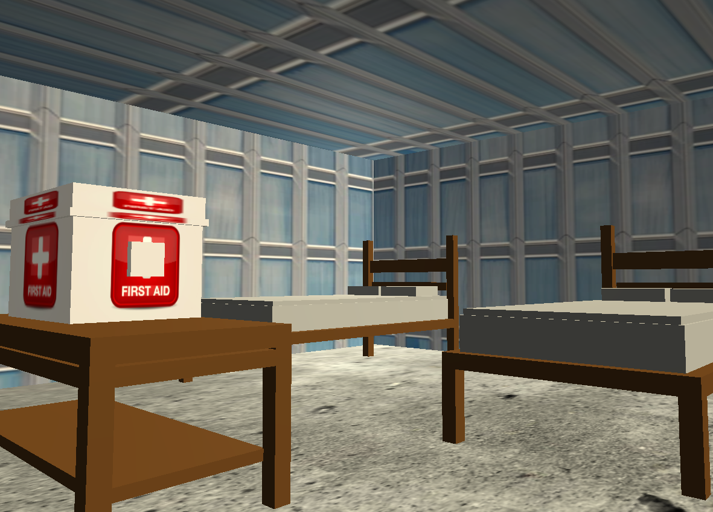
   
  <em>Figure 8: Interior of the medical center showing beds, tables, and first-aid equipment.</em>

### Boundary and Main Gate

  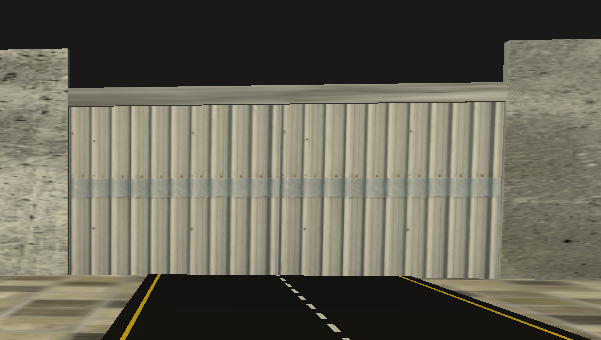
   
  <em>Figure 9: Front view of the main entrance gate and surrounding boundary walls.</em>

### Military Vehicles

  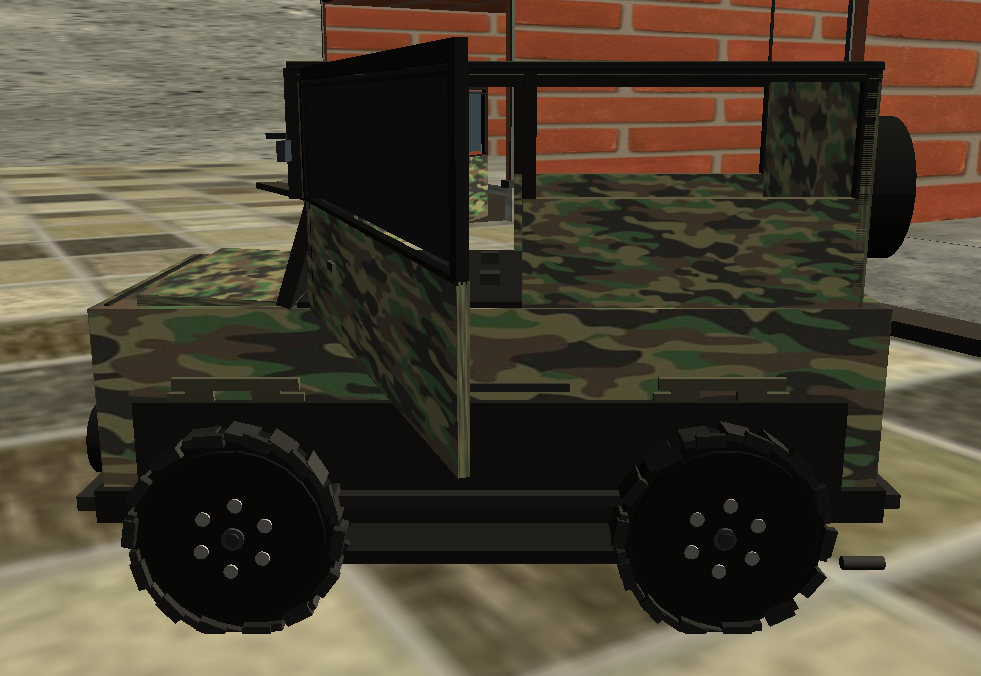
   
  <em>Figure 10: Military jeep with an open door and visible exterior details.</em>

  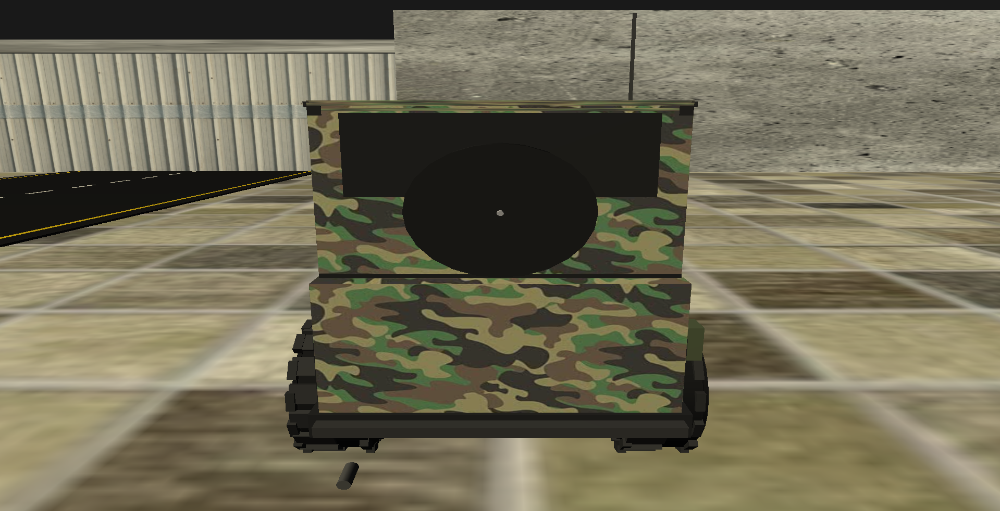
   
  <em>Figure 11: Rear view of the military jeep.</em>

  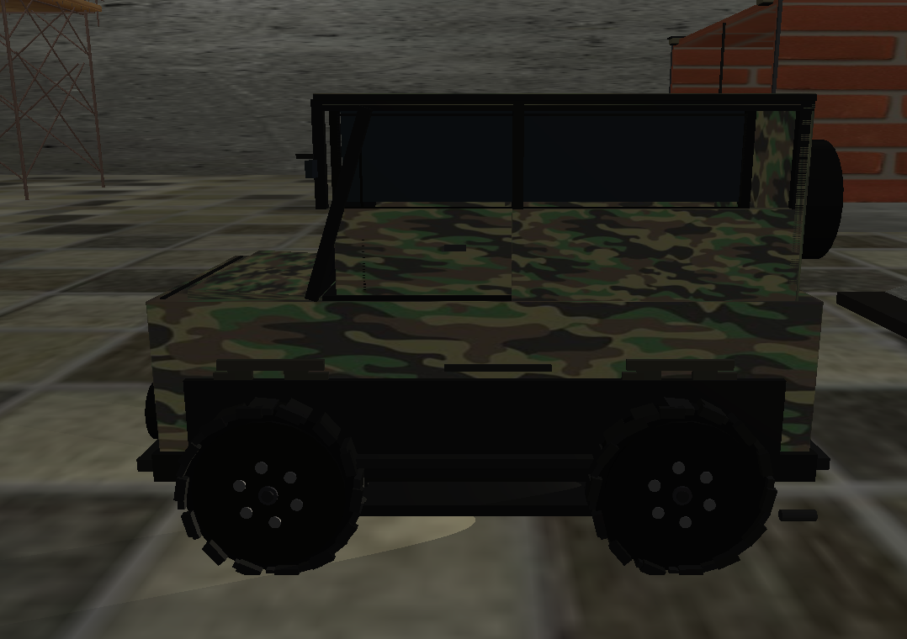
   
  <em>Figure 12: Jeep headlight spotlight illuminating the area in front of the vehicle.</em>

  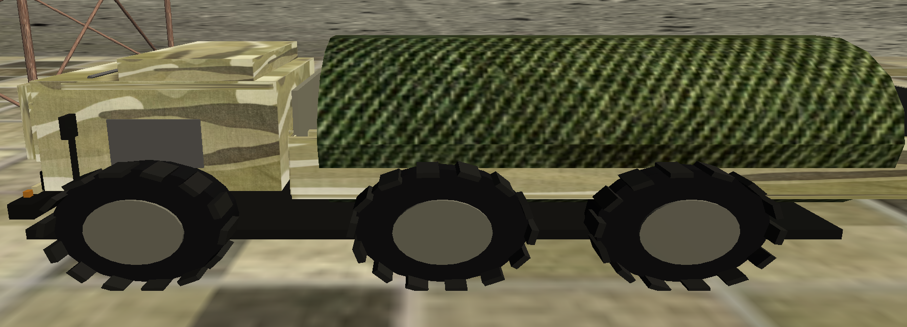
   
  <em>Figure 13: Six-wheel military truck with a driver cabin and covered cargo area.</em>

  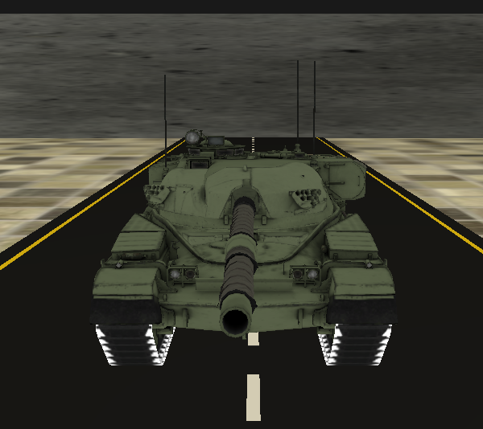
   
  <em>Figure 14: Imported military tank model positioned on the central road.</em>

### Surveillance and Camp Structures

  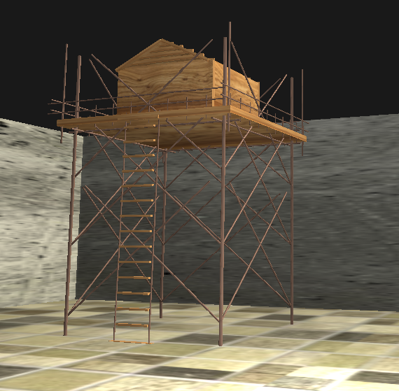
   
  <em>Figure 15: Elevated military watch tower with stairs, support pillars, and a surveillance platform.</em>

  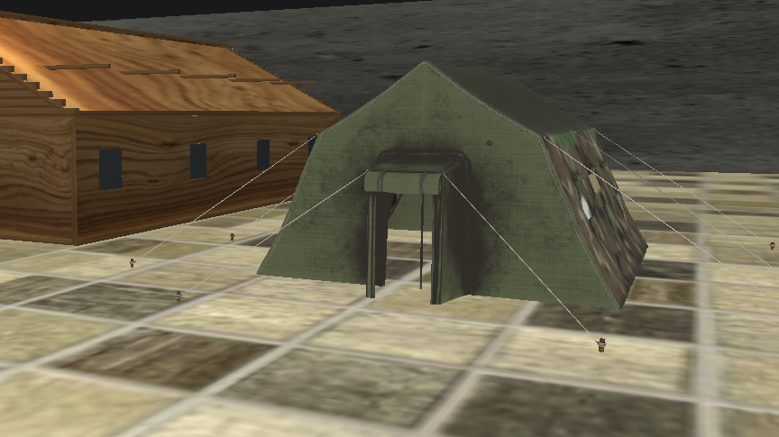
   
  <em>Figure 16: Imported military tent model placed inside the base camp.</em>

## External 3D Models

The following external assets are used in the project:

* **Tent Military** by Mehdi Shahsavan
  Source: Sketchfab
  License: CC BY 4.0

* **Chieftain MK-5 Main Battle Tank** by Muhamad Mirza Arrafi
  Source: Sketchfab
  License: CC BY 4.0

## Project Demo Video

## Project Demo Video

Watch the complete demonstration of the interactive 3D military base camp:

🎥 [Full Project Overview](https://www.youtube.com/watch?v=LRX26-Rapz0)  
*Watch the complete interactive 3D military base camp demo, including camera movement, vehicles, campfire animation, doors, radar, and day/night lighting.*

🎥 [Vehicle Obstacle Detection](https://www.youtube.com/watch?v=ra7y5r2J5SM)  
*Demonstration of vehicle obstacle detection using bounding boxes to prevent collisions with buildings, walls, and other objects.*

Backup link: [View the video on Google Drive](https://drive.google.com/drive/folders/1azzqziOwQQgxTCLuUkf7XGMTd7Ll0hzo?usp=sharing)

## Repository

GitHub Repository:
`https://github.com/sannzana/Graphics_project_military_base`

## Author

Developed as a Computer Graphics laboratory project using OpenGL.
